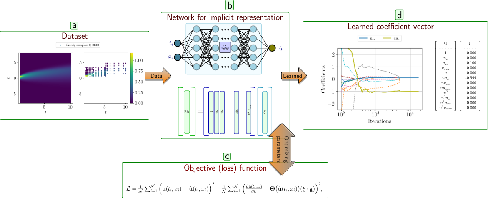

# GN-SINDy: Greedy Sampling Neural Network in Sparse Identification of Nonlinear Partial Differential Equations

We introduce the Greedy Sampling Neural Network in Sparse Identification of Nonlinear Partial Differential Equations (__GN-SINDy__), a pioneering approach that seamlessly integrates a novel greedy sampling technique, deep neural networks, and advanced sparsity-promoting algorithms. Our method not only addresses the formidable challenges posed by the curse of dimensionality and large datasets in discovering models for nonlinear __PDE__ s but also sets a new standard for efficiency and accuracy by redefining the data collection and minimization units within the __SINDy__ framework. By combining the strengths of these diverse techniques, __GN-SINDy__ represents a leap forward in the realm of model discovery, promising unprecedented insights into the intricate dynamics of complex systems.





## Installation
I assume that you already have `linux` OS to create a new `conda` environemnt.
 
To install the packge open a new `bash` terminal in your local directory and type

```bash
conda create --name GNSINDy python=3.10.6
```

This will create a conda environment with the default name `GNSINDy`.


To activate the conda environment type on the `bash` terminal 

```bash
conda activate GNSINDy
```
Then start to install the following packages:

```bash
conda install pytorch torchvision torchaudio pytorch-cuda=11.8 -c pytorch -c nvidia
conda install conda-forge::numpy
conda install conda-forge::scipy
conda install conda-forge::matplotlib
conda install conda-forge::tqdm
conda install conda-forge::pandas
conda install conda-forge::scikit-learn
conda install conda-forge::tensorboard
conda install conda-forge::natsort
conda install conda-forge::spyder
```


If you `do not want to use conda` you can create a virtual environment as explained in the following.


```bash
python -m venv <env_name>
virtualenv <env_name>
```

Activate the virtual environment based on your operating system:

• On Windows:

```bash 
.\<env_name>\Scripts\activate
```

• On linux or MacOS:

```bash 
source <env_name>/bin/activate
```


A `Spyder` IDE is already installed together with the environment. When your conda environment is activated type `Spyder` so you can use it.

__hint__: the root folder should be named `GNSINDy` so you can execute the modules. In case you download the repository and extract it in your local machine you have to consider this! Nevertheless, the root directory is `GNSINDy` and different modules are imported e.g. `from GNSINDy.src.deepymod.data import Dataset, get_train_test_loader`

If you `do not want to use conda` you can create a virtual environment as explained in the following.

```bash
python -m venv <env_name>
```

Activate the virtual environment based on your operating system:

• On Windows:

```bash 
.\<env_name>\Scripts\activate
```

• On linux or MacOS:

```bash 
source <env_name>/bin/activate
```
 
After creating a new virtual environment by using `python -m venv GNSINDy` then activate it as mentioned above then install the packages as follows

```bash
pip3 install torch torchvision torchaudio --index-url https://download.pytorch.org/whl/cu118

pip install numpy==1.23.5
pip install scipy==1.11.4
pip install matplotlib==3.5.3
pip install tqdm==4.65.0
pip install fastapi==0.96.1
pip install scikit-learn==1.0.2
pip install pandas pandas==1.5.2
pip install --upgrade transformers
pip install tensorflow natsort
```


## Usage

In the __/src/examples__ folder you can find different simulations. We considered 3 PDEs `Allen-Cahn`, `Korteweg-de Vries`, and `Burgers'`. In the __src/data__ folder you will find the dataset that are used in the article. In the __deepymod__ folder you can find different modules that are used in the package.

- go to the folder __paper__ to see the pdf format of the draft


### Burgers' Equation

- To re-generate figures `3(a)` and `3(b)` related to `Burgers'` __PDE__ run `Burger_deim_sampling.py` and `Burger_random_sampling.py` respectively.

- If you run `Burger_deim_sampling.py` then `Figure 2` will be generated as well.
- To produce the __Table 1__ run `Burger_deim_tolerance_sensitivity.py`
- To produce the __Table 2__ run  `Burger_deim_estimator_constraint_sensitivity.py`
- To produce the __Table 3__ run `Burger_deim_NN_structure.py`
- To produce the __Table 4__ run `Burger_deim_sampling.py` and `Burger_random_sampling.py` respectively

our dictionary has the following terms
$$[1,\ u,\ u_{xx},\ u,\ u u_x, u u_{xx}, u^2, u^2 u_x, u^2 u_{xx}].$$

The estimated coefficients is a __1D Vector__ for example

```python
tensor([[ 0.0000],
        [ 0.0000],
        [ 0.0985],
        [ 0.0000],
        [-0.9857],
        [ 0.0000],
        [ 0.0000],
        [ 0.0000],
        [ 0.0000]])
```

so `0.0985` is the coeffecient of the term $u_{xx}$ and `-0.9857` is the coeffecient of the term $u u_x$ while the ground truth model is

$$\frac{\partial u }{\partial t}  + 0.1 u_{xx} -1 u u_x=0 $$


### Allen-Cahn Equation

- To re-generate figures `5(a)` and `5(b)` related to `Allen-Cahn` __PDE__ run `AC_deim_sampling.py` and `AC_random_sampling.py` respectively.

- If you run `AC_deim_sampling.py` then `Figure 4` will be generated as well.
- To produce the __Table 5__ run `AC_deim_tolerance_sensitivity.py`
- To produce the __Table 6__ run  `AC_deim_estimator_constraint_sensitivity.py`
- To produce the __Table 7__ run `AC_deim_NN_structure.py` or run `AC_deim_NN_structure_2.py` by manipulating number of neurons in hiddenlayer e.g. `neu_num=8`
- To produce the __Table 8__ run `AC_deim_sampling.py` and `AC_random_sampling.py` respectively

$$[1,\  u_{x} ,\ u_{xx},\ u_{xxx},\ u ,\ u u_x,\ u u_{xx},\ u u_{xxx},\ u^2,\ u^2 u_x,\  u^2 u_{xx},\ u^2 u_{xxx},\ u^3,\ u^3 u_{x},\ u^3 u_{xx},\ u^3 u_{xxx} ].$$


The estimated coefficients is a __1D Vector__ for example


```python
tensor([[ 0.0000],
        [ 0.0000],
        [ 0.0000],
        [ 0.0000],
        [ 4.9660],
        [ 0.0000],
        [ 0.0000],
        [ 0.0000],
        [ 0.0000],
        [ 0.0000],
        [ 0.0000],
        [ 0.0000],
        [-4.9369],
        [ 0.0000],
        [ 0.0000],
        [ 0.0000]])
```

so `4.9660` is the coeffecient of the term $u$ and `-4.9369` is the coeffecient of the term $u^3$ while the ground truth model is

 $$\frac{\partial u }{\partial t} + 0.0001 u_{xx} + 5 (u-u^3) = 0 $$


### Korteweg-de Vries equation

- To re-generate figures `7(a)` and `7(b)` related to `KdV` __PDE__ run `kdv_deim_sampling.py` and `kdv_random_sampling.py` respectively.

- If you run `kdv_deim_sampling.py` then `Figure 6` will be generated as well.
- To produce the __Table 9__ run `kdv_deim_tolerance_sensitivity.py`
- To produce the __Table 10__ run  `kdv_deim_estimator_constraint_sensitivity.py`
- To produce the __Table 11__ run `kdv_deim_NN_structure.py`, number of neurons in hidden layer is manipulated via `neu_num` e.g. `neu_num = 32`
- To produce the __Table 12__ run `kdv_deim_sampling.py` and `kdv_random_sampling.py` respectively

$$ 
[1,\  u_{x} ,\ u_{xx},\ u_{xxx},\ u ,\ u u_x,\ u u_{xx},\ u u_{xxx},\ u^2,\ u^2 u_x,\  u^2 u_{xx},\ u^2 u_{xxx} ].
$$


The estimated coefficients is a __1D Vector__ for example

```python
tensor([[ 0.0000],
        [ 0.0000],
        [ 0.0000],
        [-0.9965],
        [ 0.0000],
        [-5.9908],
        [ 0.0000],
        [ 0.0000],
        [ 0.0000],
        [ 0.0000],
        [ 0.0000],
        [ 0.0000]])
```


so `-5.9908` is the coeffecient of the term $u u_x$ and `-0.9965` is the coeffecient of the term $u_{xxx}$ while the ground truth model is $$\frac{\partial u }{\partial t} -6 u u_{x} -1 u_{xxx} = 0 $$


##### hint: if you use `CPU` for the simulation you may have an issue the data that is generated via `GPU`! Please restart your kernel and do the simualtion! each example takes some minutes, hopefully not long!


__hint__: To plot the time evolution of the coefficients throught the iterations we load the log file via this syntax: `history = load_tensorboard(foldername)`
. Please bear in mind that this part of the code is not essential for the core part of the algorithm and it is just a way to have graphical plots. If input settings such as order of `Dictionary (in the code with poly_order = 3, diff_order = 3)` is changed this part of the code also has to be modified so you can see the timem evolution of the coefficients. `history` is a dictionary with associated `key` and `value`.


## Extra modules

This repository contains extra simulation examples for PDE parameter estimation based on domain decomposition and ensembling methods. For farther details you can consider the following paper [DeePyMOD](https://github.com/PhIMaL/DeePyMoD). 


## Contributing

Feel free to clone the repository and extend.


## Where to find us?

Max Planck Institute for Dynamics of Compelx Technical Systems, CSC group, Magdeburg, 39106, Germany.
You can either drop an email to the authors.

Email Me: (forootani@mpi-magdeburg.mpg.de/alifoootani@ieee.org)

Email Me: (benner@mpi-magdeburg.mpg.de)


## License

[MIT](https://choosealicense.com/licenses/mit/)